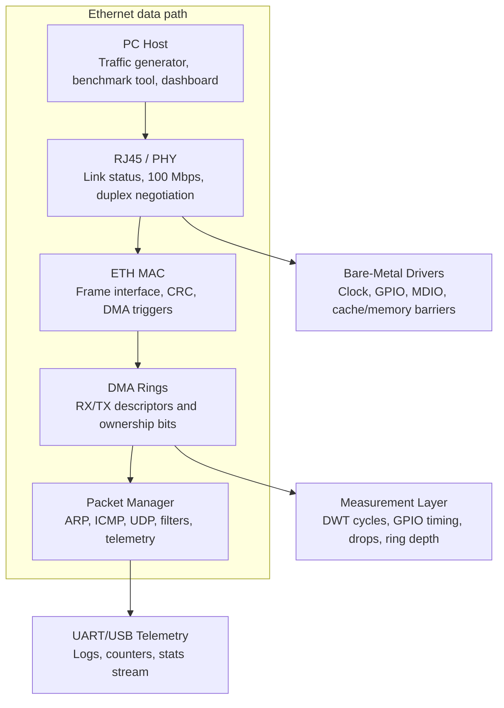
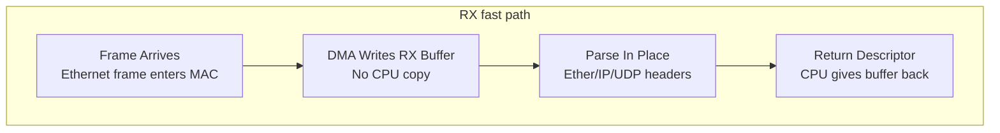
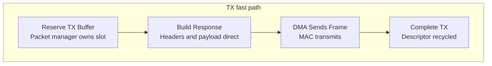

# uNIC: Zero-Copy Ethernet Packet Manager

*Professional project proposal for an STM32 Nucleo-H563ZI embedded networking system*

| | |
|---|---|
| **Target board** | STM32 Nucleo-H563ZI / STM32H563ZI Cortex-M33 |
| **Primary domain** | Embedded firmware, Ethernet driver development, DMA, packet processing, performance analysis |
| **Intended audience** | Recruiters and engineers at NVIDIA, Intel, AMD, Microsoft, networking, firmware, and platform teams |
| **Core outcome** | A bare-metal packet engine that uses Ethernet MAC DMA descriptor rings and zero-copy buffers to process ARP, ICMP, UDP, telemetry, and programmable packet rules |

## Proposal Summary

This proposal defines a resume-grade embedded systems project that treats the STM32 Nucleo-H563ZI as a miniature network interface controller. The project emphasizes low-level Ethernet bring-up, DMA descriptor rings, packet-buffer ownership, zero-copy RX/TX paths, manual implementation of selected network protocols, and measurable performance. The final artifact is not a generic web server or example-based demo. It is a driver-oriented packet manager with documentation, benchmarks, visual telemetry, and a strong engineering narrative.

The project is intentionally scoped to demonstrate skills valued by firmware, platform, SoC, networking, validation, and systems teams: register-level reasoning, hardware/software boundaries, memory movement, interrupt behavior, throughput/latency tradeoffs, and reproducible measurement.

**Prepared for:** Vaibhav Attre  
**Recommended positioning:** Firmware + systems + networking project for internship/full-time resume and GitHub portfolio

## 1. Executive Summary

uNIC is a bare-metal Ethernet packet manager for the STM32 Nucleo-H563ZI board. The system receives Ethernet frames using the STM32 Ethernet MAC and DMA, parses packets directly from DMA-owned buffers, applies programmable packet actions, and transmits responses through TX DMA buffers. The result is a compact but serious firmware project that resembles a simplified NIC driver and packet-processing datapath.

The design avoids hiding all complexity behind a full TCP/IP stack. Instead, the firmware manually implements the core pieces needed for a useful network endpoint: Ethernet II frame parsing, ARP responses, ICMP echo replies, UDP echo/sink modes, packet counters, ring occupancy tracking, and host-driven benchmark tooling. This makes the project easy to explain in interviews while still being technically deep.

### Key Differentiator

The main differentiator is that this project focuses on the packet data path instead of a high-level network application. It demonstrates how packets physically move between Ethernet hardware, DMA descriptors, memory buffers, interrupts, and firmware logic.

### Primary Goals

- Bring up the Ethernet MAC/PHY path on the STM32 Nucleo-H563ZI board.
- Implement RX and TX DMA descriptor rings with explicit CPU/DMA ownership tracking.
- Build a zero-copy packet-buffer model that parses RX packets in-place and constructs TX responses directly in transmit buffers.
- Implement a minimal network layer: ARP, IPv4 validation, ICMP echo response, UDP echo, UDP sink, and stats/control ports.
- Add performance instrumentation for packets per second, cycles per packet, drops, ring occupancy, interrupt rate, and latency.
- Produce a clean GitHub portfolio with architecture docs, benchmark graphs, and a demo video.

## 2. Board and Platform Rationale

The STM32H563ZI is a strong fit because it is powerful enough to support realistic embedded networking work while still forcing careful memory and timing decisions. ST lists the STM32H563ZI as a high-performance Arm Cortex-M33 MCU with TrustZone, 2 MB flash, 640 KB RAM, and a 250 MHz CPU. The STM32H563/573 line also includes Ethernet-capable variants and high-performance security/peripheral support. Zephyr's Nucleo-H563ZI board documentation identifies the Nucleo board as an affordable Cortex-M33 development platform with USB Type-C and Ethernet RJ45 connectivity. These platform features make the board appropriate for a firmware project centered on Ethernet, DMA, and performance analysis.

| Platform feature | Why it matters for this project |
|---|---|
| Arm Cortex-M33 at up to 250 MHz | Enough processing headroom to compare interrupt, polling, and batch packet paths while still requiring efficient firmware. |
| 2 MB flash / 640 KB SRAM | Enough memory for firmware, packet buffers, descriptors, telemetry, and benchmark logic without hiding poor allocation choices. |
| Ethernet MAC support | Allows the project to focus on real packet movement through MAC, PHY, DMA, and memory. |
| DMA | Enables descriptor-ring based RX/TX paths and hardware-driven memory transfers. |
| USB/ST-LINK virtual COM | Provides simple debug logging and telemetry streaming to a Python host dashboard. |
| Nucleo headers | Optional expansion for logic analyzer probes, power sensing, or GPIO timing measurements. |

References for board/spec details are listed in [Section 16](#16-references).

## 3. Problem Statement

Most student embedded networking projects stop at using a library to host a webpage, send a UDP message, or read a sensor over Wi-Fi. Those projects demonstrate application usage but not deep firmware understanding. They rarely show how packets enter memory, how descriptors are recycled, how interrupt rate affects CPU overhead, or how to quantify data-path performance.

This project addresses that gap by building a small but measurable packet manager. The STM32 becomes a controlled environment for studying core systems concepts: DMA, ring buffers, memory ownership, zero-copy design, interrupt vs polling tradeoffs, packet parsing, backpressure, and benchmark methodology.

The project is successful when the board can receive traffic from a host PC, resolve ARP, answer pings, run UDP echo/sink workloads, expose live stats, and show benchmark results that compare data-path designs.

## 4. Proposed System Architecture



> The board is treated like a tiny NIC: packets move through hardware-owned DMA buffers into a firmware packet engine without repeated copies.

The architecture is divided into four layers. The hardware layer handles the physical link and Ethernet frame movement. The driver layer manages MAC/PHY configuration, DMA descriptors, and buffer ownership. The packet manager layer parses packets and applies protocol-specific or rule-based actions. The host tooling layer generates traffic and visualizes results.

| Layer | Responsibilities | Key outputs |
|---|---|---|
| Hardware/link | Ethernet cable, RJ45, PHY, MAC, link status, speed/duplex negotiation | Confirmed link-up and active frame reception |
| Driver | MAC initialization, MDIO/PHY access, RX/TX descriptor ring setup, interrupts, memory barriers | Reusable low-level Ethernet driver |
| Packet manager | In-place Ethernet/IPv4/ARP/ICMP/UDP parsing, rule matching, response generation | Zero-copy packet engine and protocol handlers |
| Measurement/tooling | Python traffic generator, telemetry dashboard, benchmark runner, CSV/plot export | Repeatable performance data and demo artifacts |

## 5. Hardware Components

The minimum hardware is intentionally modest. The project should demonstrate that the value is in the software architecture and measurement discipline, not in buying a large number of modules.

| Component | Required? | Purpose |
|---|---|---|
| STM32 Nucleo-H563ZI board | Required | Main firmware target, Ethernet MAC/PHY access, USB debug connection, GPIO timing pins. |
| USB-C cable | Required | Power, flashing, ST-LINK debugging, virtual COM telemetry. |
| Ethernet cable | Required | Connect board to PC, router, or switch for packet tests. |
| PC or laptop | Required | Runs Python host tools, sends UDP traffic, captures results, and optionally uses Wireshark. |
| Ethernet switch or router | Recommended | Simplifies testing and ARP behavior compared with direct PC-to-board setup. |
| Logic analyzer | Optional | Measures GPIO timing around interrupt entry, packet processing, and TX completion. |
| INA219/INA226 current sensor | Optional stretch | Measures current draw and estimates energy per packet. |
| Second STM32/Raspberry Pi | Optional stretch | Adds a second network endpoint for stress or forwarding experiments. |

## 6. Software Components

The firmware is designed as a layered system. It should be written primarily in C, with small assembly only if needed for startup or precise platform support. The host tooling should be written in Python to keep benchmarking and visualization fast to iterate.

| Component | Description | Engineering value |
|---|---|---|
| Startup/platform | Clock setup, vector table, linker script, memory layout, UART logging, debug build configuration. | Shows board bring-up and bare-metal fundamentals. |
| MAC/PHY driver | Initializes Ethernet MAC, communicates with PHY through MDIO/MDC, handles link-up state. | Shows hardware/software interface work. |
| DMA ring manager | Allocates RX/TX descriptors, assigns buffers, handles ownership transitions, recycles descriptors. | Core driver and systems concept. |
| Packet buffer manager | Wraps DMA buffers with metadata such as length, capacity, descriptor index, and ownership flags. | Makes zero-copy design explicit and testable. |
| Protocol handlers | Ethernet II, ARP, IPv4, ICMP echo, UDP echo/sink/control/stats. | Demonstrates low-level network understanding. |
| Packet rule engine | Matches fields such as EtherType, IP protocol, UDP port, and applies actions such as drop, count, echo, stats, or reply. | Makes the project unique compared with a simple UDP demo. |
| Telemetry module | Exports counters, drops, cycles, ring occupancy, interrupt counts, and mode state over UART or UDP stats packets. | Turns the project into a measurable system. |
| Python host tools | Traffic generator, benchmark runner, telemetry dashboard, CSV exporter, graph generator. | Creates a polished engineering workflow and portfolio evidence. |

## 7. Zero-Copy Design





> **Success criterion:** RX parsing happens directly from DMA buffers; TX packets are constructed directly in transmit buffers.

The central design goal is to remove unnecessary memory copies from the packet path. In a normal layered design, a packet might be copied from a DMA buffer into a driver buffer, then copied again into a network-stack buffer, then copied again into an application buffer. For this project, the RX path should parse the packet directly from the DMA receive buffer. The TX path should construct responses directly inside a DMA transmit buffer.

### Ownership Model

The driver must explicitly track whether each descriptor and buffer is owned by DMA or by the CPU. DMA-owned RX buffers may be written by hardware and must not be modified by firmware. CPU-owned RX buffers may be inspected by firmware after the DMA marks the descriptor complete. TX buffers reverse this relationship: firmware constructs the packet while the CPU owns the buffer, then hands the descriptor to DMA for transmission.

| State | RX meaning | TX meaning |
|---|---|---|
| DMA owns descriptor | Hardware may write an incoming frame into the buffer. | Hardware may read the prepared frame and transmit it. |
| CPU owns descriptor | Firmware may parse the completed frame and then recycle the descriptor. | Firmware may prepare a frame or reclaim a completed transmit descriptor. |
| Backpressure | RX ring fills if firmware cannot recycle descriptors fast enough. | TX ring fills if firmware creates packets faster than DMA can transmit. |

## 8. Network Protocol Scope

The project should not attempt a full TCP/IP stack. That would hide the main learning value and create unnecessary complexity. A focused subset is enough to demonstrate real networking behavior and enable strong benchmarking.

| Protocol/function | Purpose | Test/demo |
|---|---|---|
| Ethernet II | Parse destination MAC, source MAC, EtherType, payload length. | Print or count raw frames; filter broadcast/unicast traffic. |
| ARP | Allow the PC to discover the board's MAC address for its static IP. | `arp -a` and `ping` should resolve board MAC. |
| IPv4 validation | Check version, header length, total length, protocol, destination IP, and header checksum. | Reject malformed or non-target traffic. |
| ICMP echo | Reply to ping for easy liveness testing. | Ping board IP from PC. |
| UDP echo | Return payload to sender for correctness and latency testing. | Python client sends packet and verifies response. |
| UDP sink | Receive and count packets without replying for maximum RX throughput tests. | Host sends increasing offered loads and reads drop counters. |
| UDP stats/control | Query counters and configure packet rules. | Host dashboard shows live data. |

## 9. Programmable Packet Manager

The unique feature is a small rule engine that turns the board into a programmable packet processor. Instead of hard-coding only ping and UDP echo, the firmware will maintain a small table of match-action rules. A host tool can configure these rules using a simple control protocol over UDP or UART.

| Match field | Example | Possible action |
|---|---|---|
| EtherType | IPv4 or ARP | Drop, count, pass to protocol handler |
| IP protocol | ICMP or UDP | Reply, drop, count |
| UDP destination port | 7000, 7001, 7002, 7003 | Echo, sink, return stats, update control state |
| Packet length | Less than 128 bytes or greater than 1024 bytes | Count small packets, drop oversized packets |
| Source IP | Host PC address | Allowlist or count traffic by source |

This feature gives the project a SmartNIC-like flavor at microcontroller scale. The board is not a router and not a full network stack. It is a deterministic, measurable, programmable packet action engine.

## 10. Measurement and Evaluation Plan

A competitive project needs measurements. The final proposal, README, and demo should include graphs and tables showing how firmware design choices affect performance.

| Metric | How to measure | Why it matters |
|---|---|---|
| Packets per second | Host benchmark sends fixed-size UDP packets and reads board counters. | Primary throughput metric. |
| Goodput | Count payload bytes received per second, excluding protocol overhead where useful. | Shows useful data movement, not just frame count. |
| Cycles per packet | Use DWT cycle counter around packet-processing path. | Direct measure of firmware efficiency. |
| RX drops | Count descriptors unavailable, malformed packets, and software drops separately. | Shows where the system fails under load. |
| RX/TX ring occupancy | Track current and maximum used descriptors. | Reveals buffer pressure and backpressure behavior. |
| Interrupt rate | Count Ethernet IRQs per second and compare with packets per second. | Shows cost of interrupt-driven designs. |
| Latency | UDP echo round-trip from host; optional GPIO timing for firmware-only latency. | Shows real-time behavior and jitter. |
| CPU busy estimate | Measure active processing time vs idle loop time. | Shows efficiency and headroom. |
| Energy per packet | Optional current sensor plus packet counters. | Strong stretch metric for platform/firmware roles. |

### Benchmark Experiments

1. **Packet size sweep:** 64, 128, 256, 512, 1024, and 1472 byte UDP payloads.
2. **Offered load sweep:** Increase packets per second until drops begin.
3. **RX mode comparison:** Interrupt mode vs polling mode vs hybrid interrupt-wakeup polling.
4. **Ring-size comparison:** Measure drop rate and latency as descriptor count changes.
5. **Batch-size comparison:** Process one packet at a time vs processing packets in small batches.
6. **Zero-copy comparison:** Compare in-place RX parsing against an intentionally copied baseline.

## 11. Implementation Milestones

| Milestone | Outcome | Acceptance criteria |
|---|---|---|
| M1: Board bring-up | UART logs, clock setup, project skeleton, reproducible build/flash flow. | Board boots and prints firmware version over serial. |
| M2: Ethernet link | PHY reset, MDIO reads/writes, MAC address configuration, link detection. | Firmware reports link-up, speed, and duplex. |
| M3: RX ring | DMA descriptors and RX buffers initialized. | Firmware receives raw frames and prints frame length/EtherType counters. |
| M4: TX ring | Transmit descriptors and buffers initialized. | Firmware can send a raw Ethernet frame or test packet. |
| M5: ARP + ICMP | ARP responder and ping reply. | PC can resolve board MAC and ping board IP. |
| M6: UDP echo/sink | Minimal IPv4/UDP parsing and response generation. | Python client verifies echo; sink mode counts packets. |
| M7: Zero-copy cleanup | RX parsing in DMA buffer; TX response constructed in TX buffer. | No `memcpy` in RX fast path except optional checksum/payload-specific cases. |
| M8: Telemetry | Stats over UART or UDP stats port. | Dashboard shows pps, drops, cycles, ring occupancy. |
| M9: Rule engine | Configurable match-action packet rules. | Host tool can add/drop/count/echo rules. |
| M10: Benchmark/report | Graphs, README, demo video, resume bullets. | Project can be explained in 60 seconds and defended technically. |

## 12. Timeline

A focused version can be completed in 2 to 4 weeks if the project uses a minimal protocol subset and clear milestones. A more polished portfolio version may take 5 to 7 weeks depending on how much benchmark automation, documentation, and stretch work is added.

| Week | Focus | Deliverables |
|---|---|---|
| Week 1 | Project skeleton, UART logs, clock setup, PHY/MAC research, link detection. | Build/flash instructions, link-up logs, hardware setup photo. |
| Week 2 | RX/TX descriptors, raw frame receive/transmit, ARP and ICMP. | PC can ping board; Wireshark capture validates packets. |
| Week 3 | UDP echo/sink, zero-copy buffer model, basic telemetry. | Python UDP tools and first benchmark table. |
| Week 4 | Performance instrumentation and graphs. | Cycles/packet, drops, pps, ring occupancy, latency results. |
| Week 5 | Rule engine and control protocol. | Programmable packet actions and dashboard controls. |
| Week 6 | Interrupt vs polling vs hybrid comparison, batch processing. | Performance comparison report with conclusions. |
| Week 7 | Polish: documentation, diagrams, demo video, resume bullets. | Public GitHub-ready portfolio artifact. |

## 13. Risks and Mitigations

| Risk | Impact | Mitigation |
|---|---|---|
| Ethernet bring-up complexity | Project may stall before packet work begins. | Start from official board examples or reference docs only for register values, then isolate and rewrite the driver pieces you understand. |
| PHY/MAC clock or pin configuration issues | No link or no packets. | Make link detection Milestone 2; use serial logs and Wireshark early. |
| DMA descriptor ownership bugs | Random drops, corrupted frames, hard faults. | Add descriptor state assertions, counters, and a descriptor dump command. |
| Cache/memory ordering issues | DMA sees stale data or CPU sees stale buffers. | Use correct memory placement, barriers, and cache maintenance if applicable to the configuration. |
| Scope creep into full TCP/IP | Too much work, less driver focus. | Limit protocol scope to ARP, ICMP, UDP, stats/control. |
| Benchmark results look weak | Resume value decreases if no measurements are shown. | Compare multiple modes and focus on analysis, not just absolute max throughput. |

## 14. Deliverables

The final project should have both working firmware and professional portfolio evidence. The GitHub repository should be organized so a recruiter can quickly understand the project and an engineer can verify the technical depth.

| Deliverable | Description |
|---|---|
| Firmware source | Bare-metal C firmware with drivers, packet manager, protocol handlers, telemetry, and tests where practical. |
| Host tools | Python traffic generator, benchmark runner, dashboard, CSV exporter, graph generator. |
| Architecture documentation | Block diagrams, RX/TX data path explanation, descriptor ownership model, memory layout. |
| Benchmark report | Measured packets/sec, drops, cycles/packet, latency, ring occupancy, and mode comparisons. |
| Demo video | 60 to 90 second walkthrough showing ping, UDP benchmark, dashboard, and architecture diagram. |
| Resume bullets | Concise bullets emphasizing DMA, zero-copy buffers, packet engine, protocol implementation, and benchmarking. |

### Recommended Repository Layout

```text
firmware/
  drivers/
  net/
  packet_manager/
  telemetry/
tools/
  host_sender.py
  host_benchmark.py
  telemetry_dashboard.py
docs/
  architecture.md
  zero_copy_design.md
  benchmark_results.md
results/
  csv/
  plots/
tests/
  hil/
```

## 15. Resume and Interview Positioning

The project should be positioned as a low-level systems and firmware project, not a hobby networking demo. The language should emphasize implementation, measurement, and tradeoff analysis.

### Suggested Resume Bullets

- Built uNIC, a bare-metal zero-copy Ethernet packet engine on STM32H563ZI Cortex-M33, implementing MAC/PHY bring-up, DMA RX/TX descriptor rings, packet-buffer ownership tracking, ARP, ICMP, and UDP without a full TCP/IP stack.
- Designed an in-place RX parser and direct-to-TX response path to reduce packet copies, with telemetry for packets/sec, drops, cycles/packet, interrupt rate, and RX/TX ring occupancy.
- Implemented programmable match-action packet rules for UDP/ICMP traffic and developed Python host tools for traffic generation, benchmarking, live visualization, and CSV/plot export.
- Compared interrupt-driven, polling, hybrid, and batched RX modes using cycle-counter instrumentation and optional GPIO timing to analyze throughput/latency tradeoffs.

### Interview Narrative

> I wanted to build something closer to a real NIC driver than a generic embedded app. So I brought up Ethernet on the STM32, built RX/TX DMA rings, tracked DMA/CPU ownership, manually implemented the protocol subset needed for ARP, ping, and UDP, and measured how zero-copy buffers, batching, and interrupt strategy affected packet throughput and latency.

## 16. References

The following sources should be used for board-specific claims in the README and final report. The implementation should still verify behavior directly on the board.

| Source | Use in proposal/report | URL |
|---|---|---|
| STMicroelectronics STM32H563ZI product page | High-performance Arm Cortex-M33 with TrustZone, 2 MB Flash, 640 KB RAM, 250 MHz CPU. | [STM32H563ZI product page](https://www.st.com/en/microcontrollers-microprocessors/stm32h563zi.html) |
| STMicroelectronics STM32H562xx/STM32H563xx datasheet | Detailed MCU specification including core, memory, peripherals, and Ethernet-related capabilities. | [STM32H563 datasheet](https://www.st.com/resource/en/datasheet/stm32h563ri.pdf) |
| STMicroelectronics UM3115 STM32H5 Nucleo-144 board user manual | Board-level features, connectors, Ethernet, USB, ST Zio, and morpho headers. | [UM3115 user manual](https://www.st.com/resource/en/user_manual/um3115-stm32h5-nucleo144-board-mb1404-stmicroelectronics.pdf) |
| Zephyr Nucleo-H563ZI board documentation | Board overview identifying STM32H563ZI, flash/RAM, USB Type-C, Ethernet RJ45, and development-board context. | [Zephyr Nucleo-H563ZI documentation](https://docs.zephyrproject.org/latest/boards/st/nucleo_h563zi/doc/index.html) |
| Mongoose STM32 Ethernet explained | Useful conceptual description of the MAC/PHY split and DMA-based Ethernet frame movement. | [STM32 Ethernet explained](https://mongoose.ws/articles/stm32-ethernet-explained/) |

## Appendix A. Success Criteria

| Category | Minimum success | Strong success |
|---|---|---|
| Correctness | Board responds to ARP, ping, and UDP echo. | Wireshark confirms well-formed frames and checksums under stress. |
| Zero-copy path | RX packets are parsed directly from DMA buffers. | A copied baseline is measured and compared against zero-copy. |
| Performance | Basic packets/sec and drop counters are collected. | Throughput, latency, cycles/packet, ring occupancy, and interrupts/sec are graphed across workloads. |
| Configurability | UDP sink/echo modes can be selected at build time. | Runtime match-action rules are configured from host tools. |
| Portfolio | README explains build and demo steps. | Architecture diagrams, benchmark plots, demo video, and polished resume bullets are included. |

## Appendix B. Future Extensions

- Add a tiny TCP state machine only for SYN/SYN-ACK/ACK experiments, not a full TCP stack.
- Add packet forwarding between two interfaces only if a second Ethernet interface or external adapter is available.
- Add power-per-packet measurement with INA219/INA226 and compare idle, interrupt-heavy, and polling-heavy modes.
- Add hardware-in-the-loop tests that flash firmware, send packet traces, validate counters, and detect hard faults.
- Add TrustZone split where secure firmware controls update/debug access and non-secure firmware runs the packet manager.
